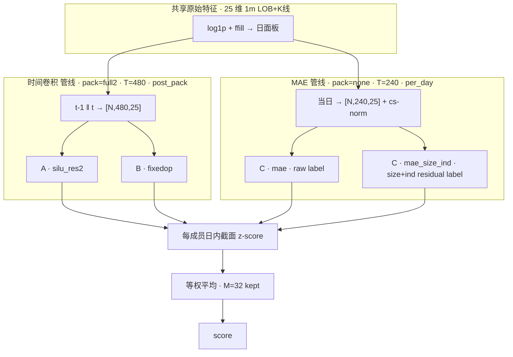
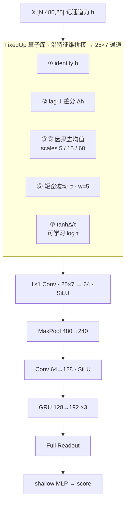
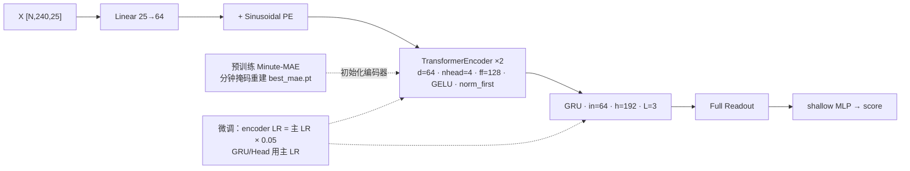

# submission_plan5_public_v3

面向比赛审查的技术方案说明。本提交是一个**多架构 × 多种子 × 多验证选点**的等权集成因子：推理入口为 `predict.ipynb` 的 `main(datasources, start_date, end_date)`，输出 `date / instrument / score`，由平台 `bigalpha_eval._latest` 评测。

---

## 1. 模型设计创新点

### 1.1 三类特征学习方案，获得不同的归纳偏置


| 类型                         | 家族                     | 核心想法                                                                            |
| -------------------------- | ---------------------- | ------------------------------------------------------------------------------- |
| **A. 时间卷积残差网络**            | `silu_res2`            | 普通时序卷积 + **SiLU** + **同分辨率残差块 ×2**，强化日内微观结构的非线性表征                               |
| **B. 固定多尺度算子卷积网络**         | `fixedop`              | 用**零/少参数**的因果算子库（差分、多尺度去均值、短窗波动、可学习温度 \tanh(\Delta/\tau)）通过1 * 1 卷积层自动学习选择算子组合。 |
| **C. Transformer预训练+微调方案** | `mae` / `mae_size_ind` | Minute-MAE Transformer 编码器（掩码重建预训练）+ 差分学习率微调（encoder LR×0.05），把自监督表征接到排序任务      |


三者共享同一套 **GRU + Full Readout** 后端，差异集中在「如何把 25 维分钟特征变成时间序列表征」，从而在集成时提供真正的结构多样性，而不是同构模型的噪声平均。

### 1.2 Full Temporal Readout（相对 last-hidden）

三族共用时间池化：

h_{\mathrm{read}} = [h_{\mathrm{last}}  h_{\mathrm{mean}}  h_{\mathrm{max}}  h_{\mathrm{attn}}]

再经浅层 MLP 出标量分数。相对「只取 GRU 最后一步」，同时保留尾部状态、全局均值、峰值与可学习注意力，更适合开盘相对收益这种**依赖全天形态**的任务。

---


## 2. 三类模型架构图

以下三图对应**三种网络结构**；`mae` 与 `mae_size_ind` 共用图 C，仅训练标签不同。

### 2.1 总览：四臂如何汇入最终因子




### 2.2 类型 A · `silu_res2`（**时间卷积残差网络**）

**输入** `[N, 480, 25]` → MaxPool 后序列长 240 → GRU → 标量分数。


要点：`CONV_ACT=silu`，`CONV_RES_BLOCKS=2`，`conv_mid=64`，`conv_out=128`。公榜权重使用 **LR=1e-4**（2e-4 曾发散）。

### 2.3 类型 B · `fixedop`（**固定多尺度算子卷积网络**）

**输入**同 A：`[N, 480, 25]`。用 FixedOpStem **替换**普通卷积 stem，**无额外残差块**；其后 MaxPool / GRU / Readout 与 A 相同。




要点：算子本身几乎无参，可学习部分主要是 1×1 融合与 \tau；用显式多尺度形态先验换取与类型 A 的异质性。

### 2.4 类型 C · `mae` / `mae_size_ind`（**Transformer预训练+微调方案**）

**输入** `[N, 240, 25]`（仅样本日；无 MaxPool）。两家族结构一致。




| 家族             | 训练标签                       | 推理特征                |
| -------------- | -------------------------- | ------------------- |
| `mae`          | raw `open_gap`（MAD+zscore） | 与 `mae_size_ind` 相同 |
| `mae_size_ind` | `open_gap` 对 SIZE+一级行业回归残差 | 同上（不依赖中性化）          |


---


## 3. 方案总览与成员规模


### 3.1 四臂角色


| family         | 架构类型 | 训练标签           | 特征打包 / 归一化            | kept（约） |
| -------------- | ---- | -------------- | --------------------- | ------- |
| `silu_res2`    | A    | raw `open_gap` | `full2` / `post_pack` | 9       |
| `fixedop`      | B    | raw `open_gap` | `full2` / `post_pack` | 8       |
| `mae`          | C    | raw `open_gap` | `none` / `per_day`    | 7       |
| `mae_size_ind` | C    | size+行业残差      | `none` / `per_day`    | 8      |


### 3.2 集成协议（硬性）

对每个交易日、每个股票：

1. 成员 m 独立前向得 s_m；
2. **先**做当日截面 z-score：z_m=(s_m-\mathrm{mean})/\mathrm{std}（std 过小则置 0）；
3. **再**等权：\mathrm{score}=\frac{1}{M}\sum_m z_m（当前 M=32）。

---


## 4. 数据、标签与预处理

### 4.1 数据与股票池

- 行情：云端 1 分钟表（`datasources["bar1m"]` / 训练侧 `CLOUD_TABLE`）。
- 股票池：`bigalpha_2026_instruments`；推理后按 `(date, instrument)` inner join。
- 每日完整 **240** 根 bar；缺失 bar 比例 > 10% 的标的当日剔除。

### 4.2 特征（25 维）


| 类别     | 列                                            |
| ------ | -------------------------------------------- |
| LOB 三档 | `ask/bid_price{1..3}`，`ask/bid_volume{1..3}` |
| K 线    | `open, high, low, close, volume, amount`     |
| 附加     | `deal_number`，三档 `ask/bid_num_orders`        |


体积类列先 `log1p`；缺失沿时间 **ffill**，仍缺失填 0。

### 4.3 标签

样本日 t：

y = \frac{\mathrm{adjopen}*{t+2}}{\mathrm{adjopen}*{t+1}} - 1

`adj_open` = 当日首根分钟 bar 的 `open * adjust_factor`。进入损失前再做截面 **MAD clip（阈值=5）+ z-score**；损失为 `soft_rankic`（\tau=1）。

### 4.4 两种特征管线

**时间卷积（类型 A/B）—** `pack=full2` **+** `post_pack`

1. 取 t-1 与 t 全日 240 bar，拼成 **480**；
2. 在 `[N,480,25]` 上做一次截面 MAD+zscore（打包前不做日度标准化）。

**MAE（类型 C）—** `pack=none` **+** `per_day`

1. 仅用样本日 **240** bar；
2. 单日 panel 上截面 MAD+zscore。

---


## 5. 共用后端与训练协议

### 5.1 共用后端（三类模型）


| 模块      | 设定                                                    |
| ------- | ----------------------------------------------------- |
| GRU     | `hidden=192`，`layers=3`，`dropout=0.10`                |
| Readout | last / mean / max / attention 拼接（768 维）               |
| Head    | `LayerNorm → Linear(64) → ReLU → Dropout → Linear(1)` |


### 5.2 时间切分（公榜训练）


| 集合           | 区间                          |
| ------------ | --------------------------- |
| Train        | `2023-01-01` ~ `2024-09-30` |
| Val（选点 / 早停） | `2024-10-01` ~ `2024-12-31` |
| Purge        | 5 个交易日                      |


`SKIP_EVAL=1`：关闭额外 test，仅用 val 协议选点。

### 5.3 优化


| 项                 | 设定                                                         |
| ----------------- | ---------------------------------------------------------- |
| Loss              | `soft_rankic`                                              |
| Optimizer         | Adam                                                       |
| LR                | 默认 `2e-4`；**silu_res2 正式权重** `1e-4`                        |
| Scheduler         | `ReduceLROnPlateau`（max，factor=0.5，patience=5，min_lr=1e-6） |
| Grad clip / AMP   | 1.0 / 开启                                                   |
| Epochs / patience | 40 / 10                                                    |
| Seeds             | 42 / 7 / 123                                               |
| MAE               | 加载 `best_mae.pt`，encoder LR ×0.05                          |


### 5.4 模型权重命名


| family       | seed42 权重名（seed7/123 加后缀）                                |
| ------------ | -------------------------------------------------------- |
| silu_res2    | `m3_full2_silu_res2_submit_min20_ep40_rk_bi`             |
| fixedop      | `m3_full2_fixedop_main_silu_submit_min20_ep40_rk_bi`     |
| mae          | `mae_gru_submit_unf0p05_min20_ep40_rk_bi`                |
| mae_size_ind | `mae_gru_submit_unf0p05_label_size_ind_min20_ep40_rk_bi` |


产物：`outputs/plan5_public/<exp>/`。

---


## 6. 早停方法与 Checkpoint 选择

从 `MIN_SELECT_EPOCH=20` 起，每个 epoch 在验证集跟踪：

1. **raw RankIC**：原始分数 vs raw `open_gap`；
2. **bi 指标**：分数经 winsorize + z-score + **Barra 十风格 + 一级行业中性** 后，相对 raw `open_gap` 计算
  - `mean_rank_ic_bi`、`rank_ic_bi_ir`、`bi_ls_sharpe`。

`VAL_METRIC=rankic_rankic_bi`：早停同时参考 raw 与 bi RankIC；**存盘以 bi 三指标为准**。


| tag                 | 选点目标            |
| ------------------- | --------------- |
| `best_rankic_bi`    | bi RankIC 最大    |
| `best_rankic_bi_ir` | bi RankIC IR 最大 |
| `best_bi_sharpe`    | bi 多空 Sharpe 最大 |


---


## 7. 目录与文件作用


| 路径                                        | 作用                                           |
| ----------------------------------------- | -------------------------------------------- |
| `predict.ipynb`                           | 公榜 / 审查入口：`main(...)`                        |
| `members.json`                            | 集成清单与审计（protocol / kept / dropped）           |
| `SUMMARY.md`                              | kept / dropped 摘要表                           |
| `model_{family}_seed{S}_{tag}_ep{E}.json` | 单成员权重（含 `model_cfg` + `state_dict`）          |
| `ensemble_infer.py`                       | 解码权重、构建模型、截面 z-score、等权                      |
| `models_m3.py`                            | 类型 A/B：`TemporalConvGRUModel`（含 FixedOpStem） |
| `mae_train.py`                            | 类型 C：`MAEEncoderGRUReadoutFull` + MAE 数据集    |
| `temporal_conv_train.py`                  | M3 数据集（full2 / post_pack）、日历与股票池工具           |
| `README.md`                               | 本说明                                          |


---


## 8. 线上推理流程

```text
members.json (kept)
  → load_ensemble_members
  → 按月：load bars → 共享 raw panel
       → M3 / MAE 各成员 forward → cs-zscore → 等权
  → 对齐 bigalpha_2026_instruments
  → DataFrame[date, instrument, score]
  → bigalpha_eval._latest
```

---

